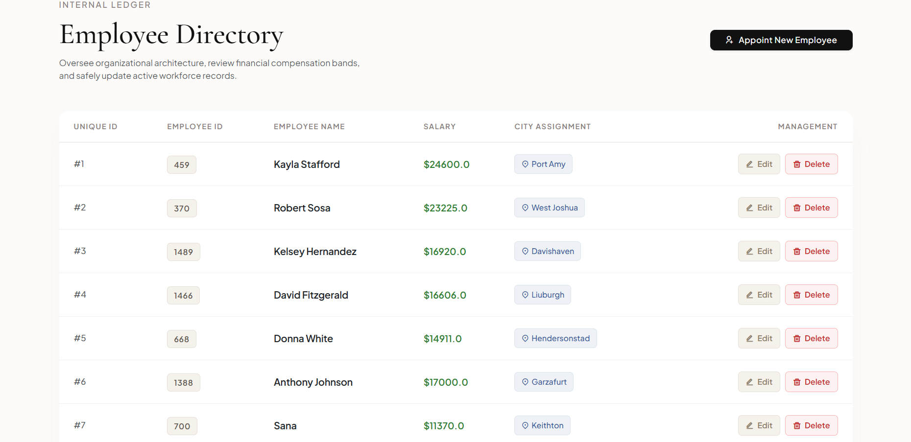
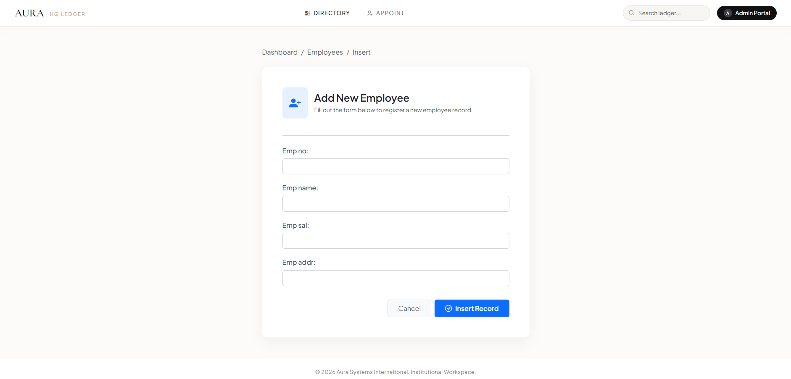
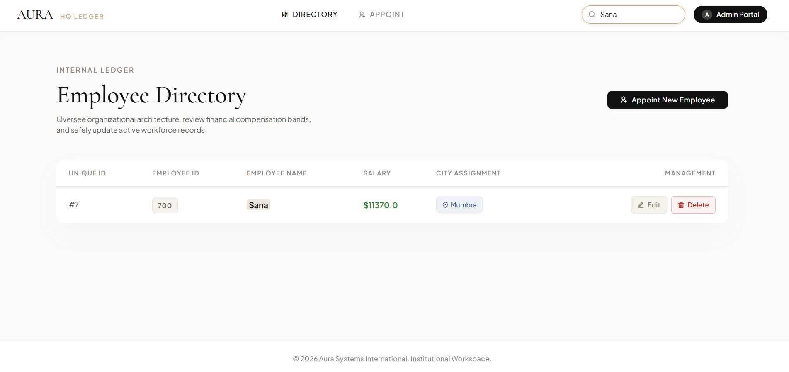

# Aura HQ Ledger ── Premium Workforce Directory

Aura HQ Ledger is an executive-tier, full-stack Python Django application designed for high-end corporate workforce registry and internal data management. Moving away from standard unstyled layouts, this system integrates a carefully curated luxury visual identity utilizing sophisticated typography pairings, a tailored jewel-toned color architecture, and ultra-responsive client-side DOM processing.

## 📸 Interface Preview

<table width="100%">
  <tr>
    <td width="50%" valign="top">
      
<b>Main Executive Directory</b>

      
    </td>
    <td width="50%" valign="top">
      
<b>Personnel Appointment Form</b>

      
    </td>
  </tr>
  <tr>
    <td colspan="2" width="100%" valign="top">
      
<b>Real-Time Index Filtering Engine</b>

      
    </td>
  </tr>
</table>

## ✨ Key Architectural Features

* **Robust Django Core:** Clean Model-View-Template (MVT) architecture managing atomic CRUD transactions securely.
* **Elite UI Framework:** Styled with custom extensions built over Bootstrap 5, dropping default corporate aesthetics for an Obsidian (`#111111`) and Champagne Gold (`#c5a880`) branding scheme.
* **Real-Time Context Indexing:** A native JavaScript search engine that filters dataset matrices instantaneously and highlights keyword matches using non-destructive inline DOM wrapping.
* **Jewel-Toned Visual Priority:** Critical data parameters (Salaries, Designations, Regions) utilize muted emerald, sapphire, and topaz badge variants to maintain maximum data scannability.
* **Fluid UX Micro-Interactions:** Custom input-glow behavior and structural hover transitions built directly into Django's `.as_p` form wrapper.

## 🛠️ Stack Composition

## 🛠️ Tech Stack & Features

<table>
  <tr>
    <td align="center" width="90">
      
       <b>Python</b>
    </td>
    <td align="center" width="90">
      
       <b>Django</b>
    </td>
    <td align="center" width="90">
      
       <b>HTML5</b>
    </td>
    <td align="center" width="90">
      
       <b>Crispy Bootstrap5  (via CDN)</b>
    </td>
  </tr>
</table>

---
* **Backend:** Python 3.11+ / Django 5.x
* **Frontend:** HTML5, CSS3, Bootstrap 5.3.2, Remix Icons
* **Engine:** Vanilla JavaScript (ES6)
* **Database:** SQLite

---

# Django Employee CRUD Application with Fake Data Population

A robust, fully functional Employee Management System built using the Django framework. This application performs full CRUD (Create, Read, Update, Delete) operations and includes a custom population script using the `Faker` library to inject dummy records into the database instantly.

## ⚡ Features

- **Full CRUD Operations:** Seamlessly Create, Retrieve, Update, and Delete employee records.
- **Automated Data Seeding:** Includes a standalone database population script powered by `Faker` to seed the database with mass random employee records.
- **Django ORM:** Utilizes Django's powerful Object-Relational Mapper for safe and clean database queries.
- **Dynamic Routing:** URL routing configured with dynamic integer IDs for accurate update and delete actions.

---

## 🛠️ Project Architecture

The project consists of an application named `testapp` integrated into the main project `crudProject`.

- **Model:** `Employee` (Fields: ID, Employee Number, Name, Salary, City)
- **Views:** Handle standard HTTP requests, form validations, and redirects.
- **Population Script:** A utility script to seed fake employee profiles.

---

## 📦 Prerequisites & Installation

Follow these steps to get the development environment running locally:

## Install Dependencies
pip install django faker

## Apply Database Migrations
python manage.py makemigrations
python manage.py migrate

## 🧪 Database Seeding (Populating Fake Data)
python populate.py

## 🏃 How to Run the Application
python manage.py runserver
